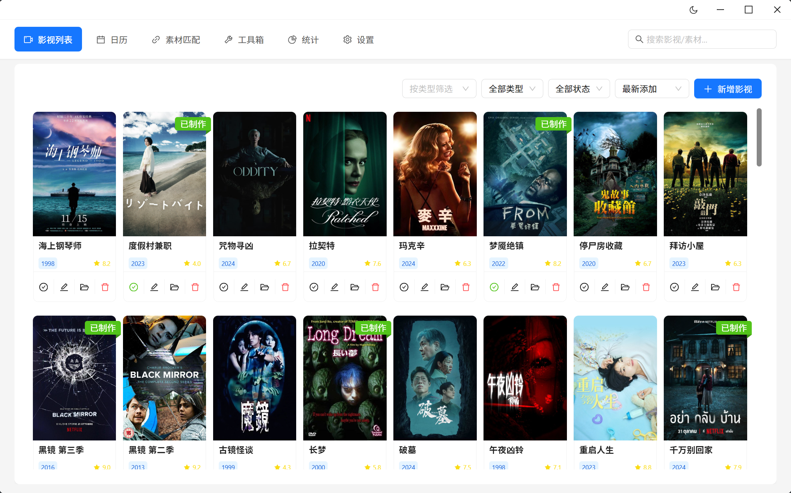
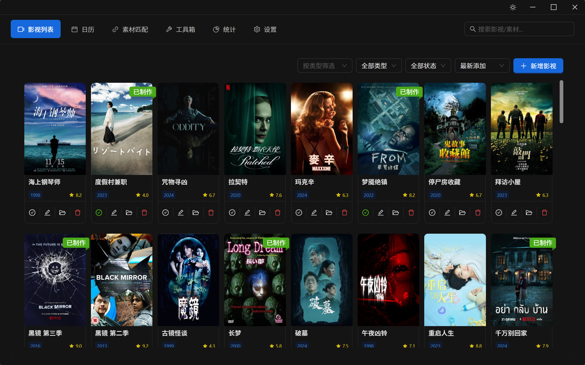
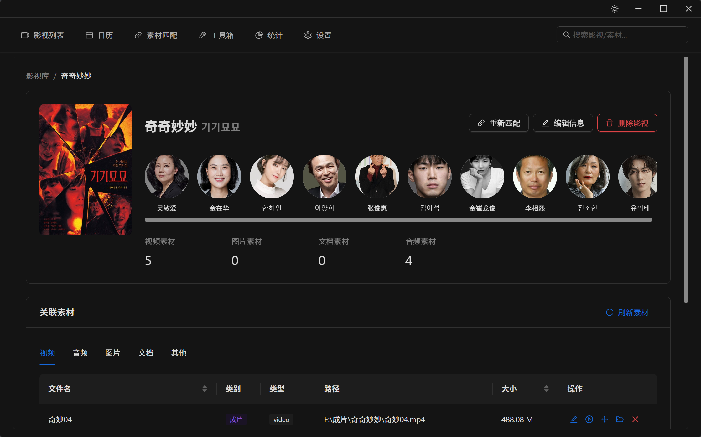
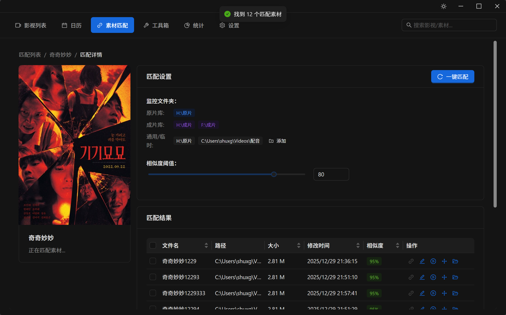
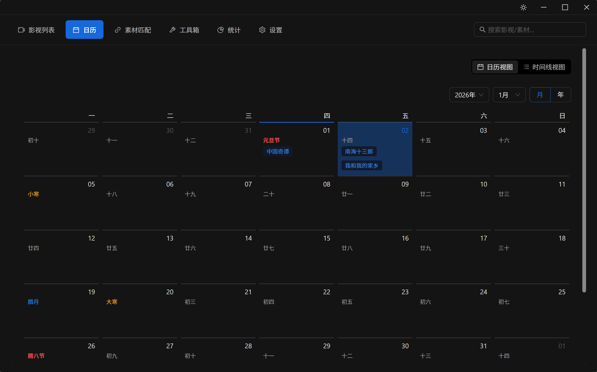
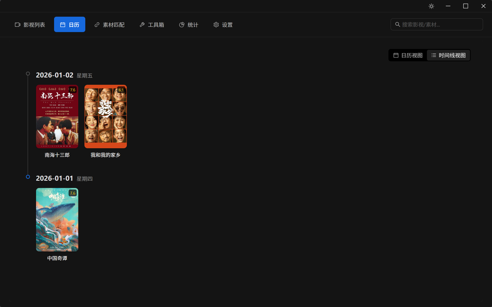
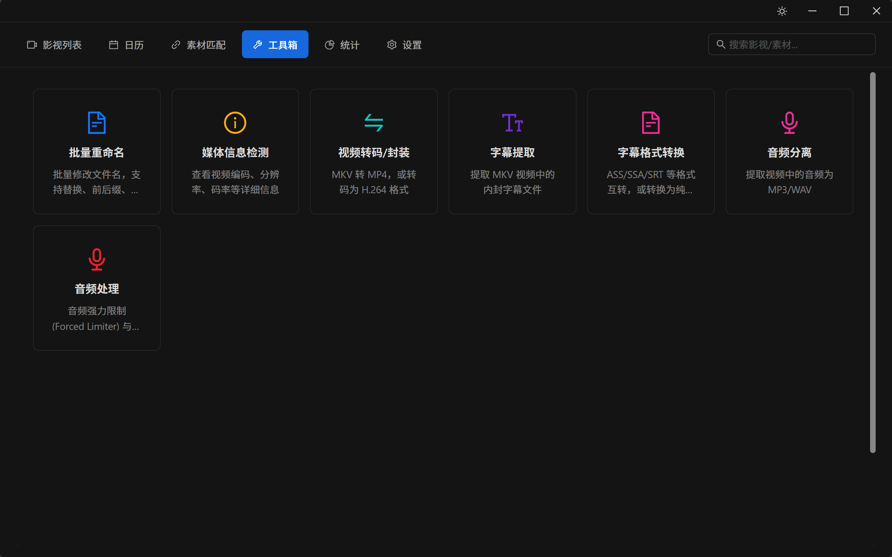
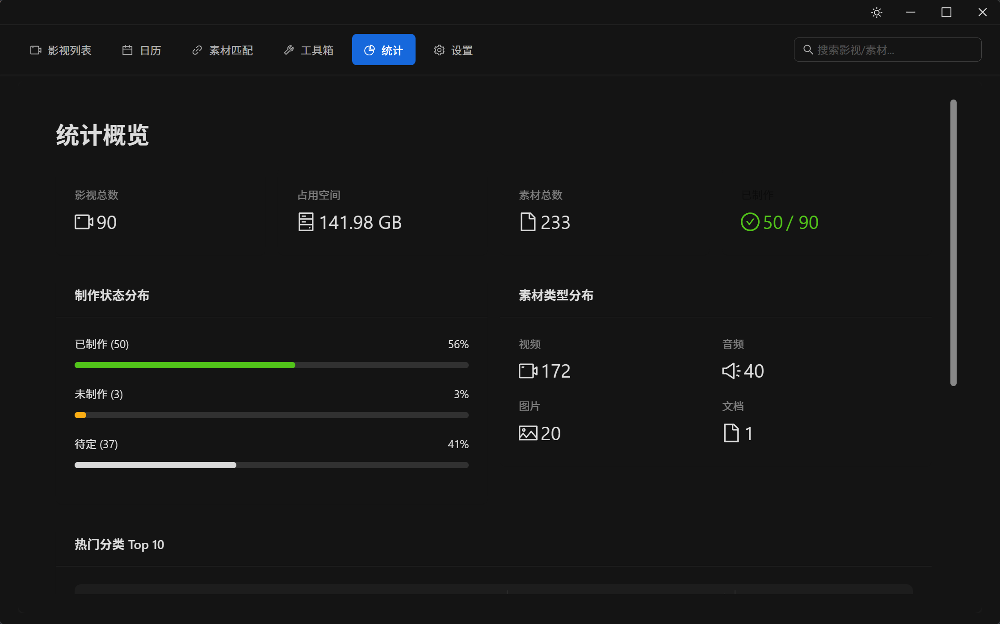
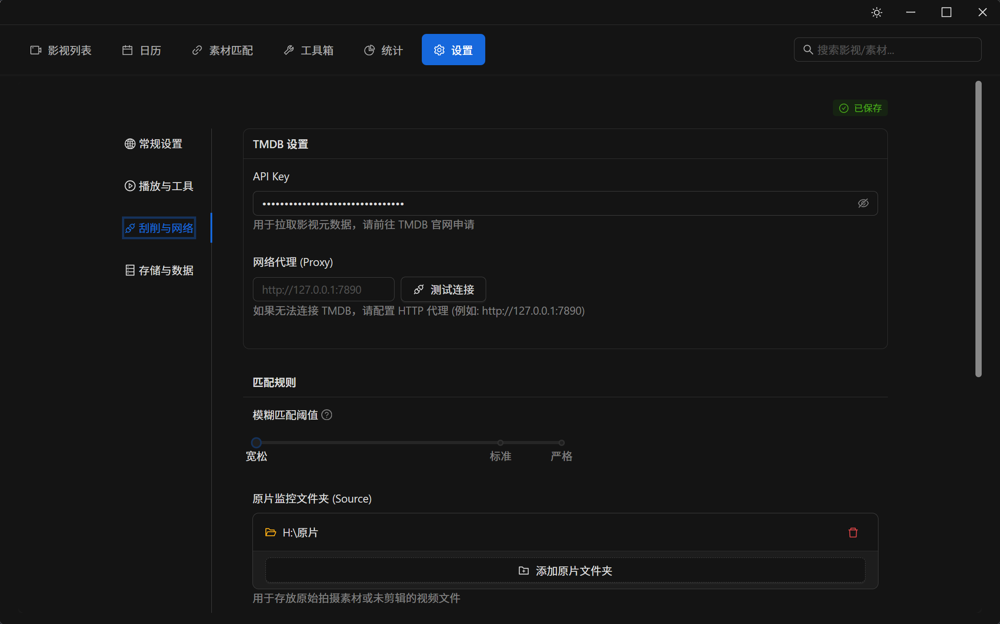

# 珍奇柜 (Zhenqigui)

珍奇柜 (Zhenqigui) 是一款专为影视剪辑从业者设计的轻量级本地素材管理工具。它通过 TMDB 获取影视元数据，并自动扫描和匹配本地文件夹中的关联素材（如配音、文案、封面等），实现影视素材的统一归类与高效检索。

## ✨ 核心功能

- **本地化管理**: 仅记录文件路径，不修改或移动原始文件，保障素材安全。
- **TMDB 集成**: 支持通过 TMDB 搜索并拉取标准化的影视信息（海报、简介、评分等）。
- **智能匹配**: 根据影视名称自动扫描指定目录，匹配相关的 MP3（配音）、DOC/DOCX（文案）、图片（封面）等素材。
- **分类管理**: 自动识别“成片”、“素材”等目录类别。
- **极速扫描**: 引入 **NTFS USN Journal** 技术，实现毫秒级文件变动检测与秒级全盘索引，彻底告别传统文件遍历的漫长等待。
- **多媒体工具箱**: 内置多种实用工具，支持**拖拽文件直达**：
  - **音频处理**: 专业的音频强力限制 (Forced Limiter) 与增益调整，支持保存/加载自定义预设。
  - **视频转码**: 快速将 MKV 等格式封装或转码为 MP4。
  - **字幕提取**: 一键提取视频文件中的内封字幕。
  - **音频分离**: 从视频中无损提取音频轨道。
  - **字幕转换**: 支持 ASS/SSA/SRT/VTT 格式互转及转换为 TXT 纯文本。
  - **媒体信息**: 查看详细的音视频编码参数。
  - **批量重命名**: 强大的文件名批量处理工具。
- **轻量高效**: 基于 Tauri 2.0 构建，跨平台（Windows），启动快，资源占用低。

## 📸 软件截图

| 主页 (Light) | 主页 (Dark) |
| :---: | :---: |
|  |  |

| 素材匹配 | 素材详情 |
| :---: | :---: |
|  |  |

| 日历视图 | 任务列表 |
| :---: | :---: |
|  |  |

| 工具箱 | 统计 |
| :---: | :---: |
|  |  |

| 设置 |
| :---: |
|  |

## 🛠️ 技术栈

- **Frontend**: React 18, TypeScript, Vite, Ant Design 6.x
- **Backend**: Rust, Tauri 2.0
- **Database**: SQLite (Rusqlite)
- **Other**: FFmpeg (用于媒体处理)

## 🚀 开发指南

### 环境要求

- Node.js (建议 v18+)
- Rust (最新稳定版)
- VS Code (推荐编辑器)

### 安装依赖

```bash
npm install
```

### 启动开发环境

```bash
npm run tauri dev
```

### 打包构建

```bash
npm run tauri build
```

## 📂 目录结构

- `src/`: 前端 React 代码
  - `pages/`: 页面组件
  - `components/`: 通用组件
  - `services/`: API 服务调用
- `src-tauri/`: 后端 Rust 代码
  - `src/commands/`: Tauri 命令实现（模块化：media, files, movie, usn 等）
  - `src/models/`: 数据模型

## 📄 许可证

本项目采用 MIT 许可证。详见 [LICENSE](LICENSE) 文件。
